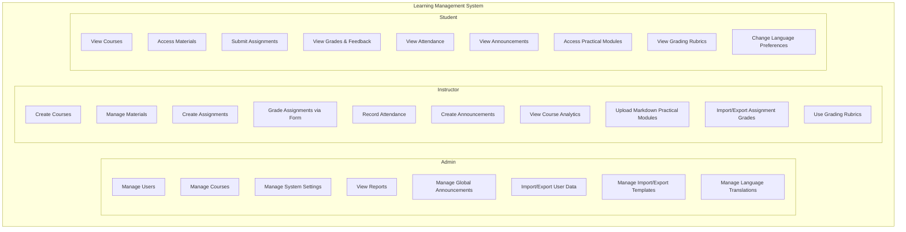
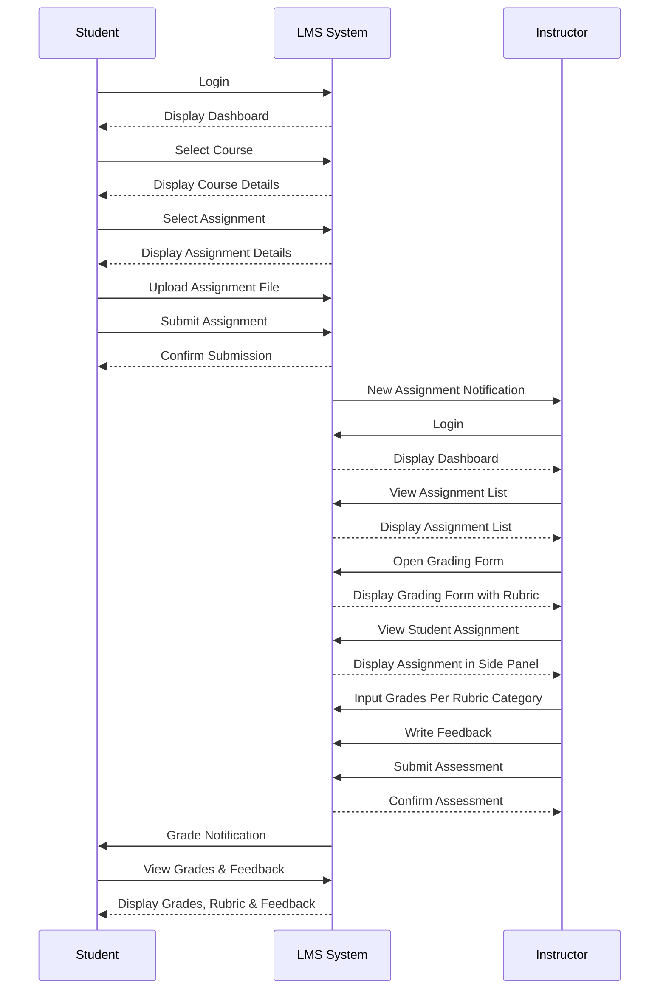
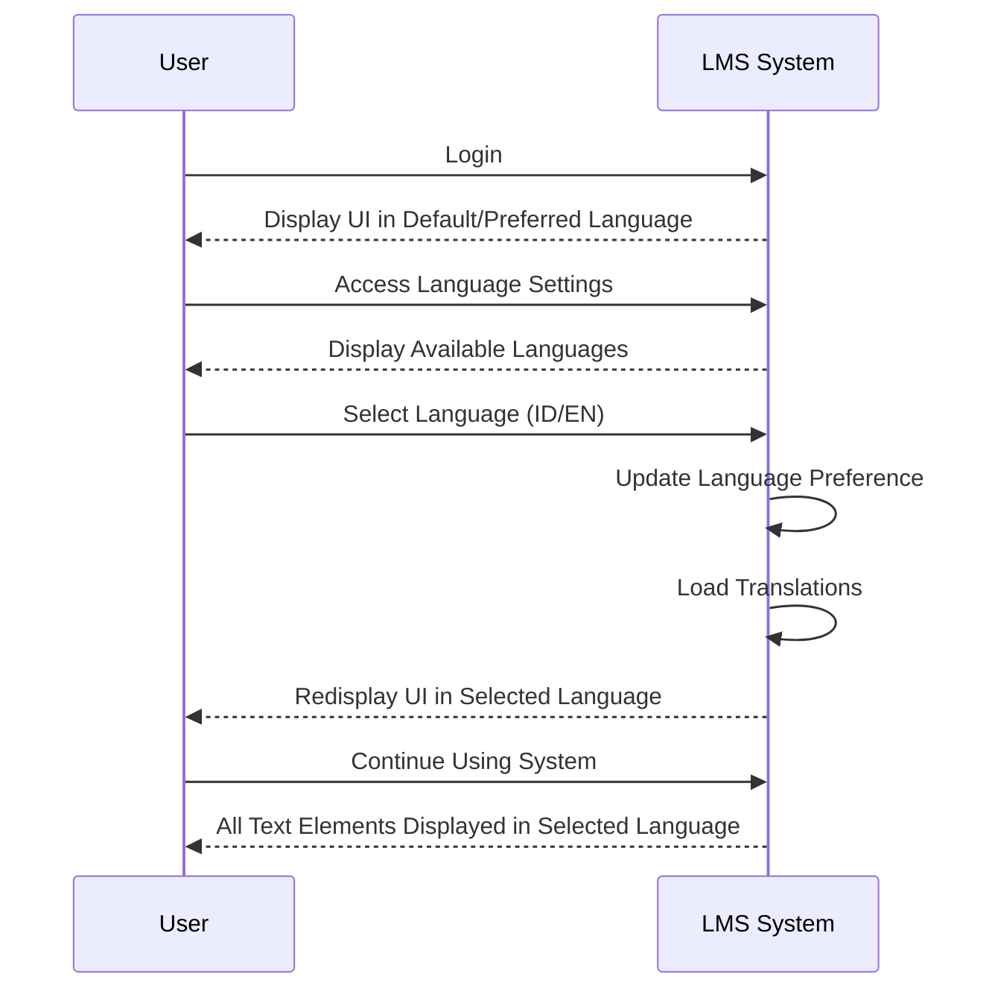
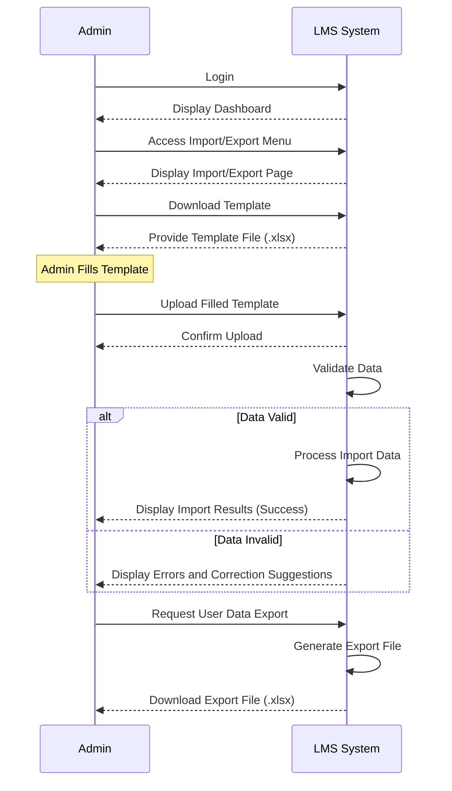
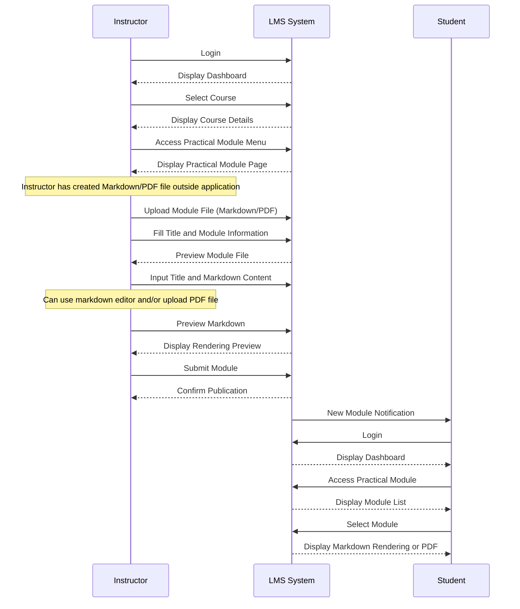
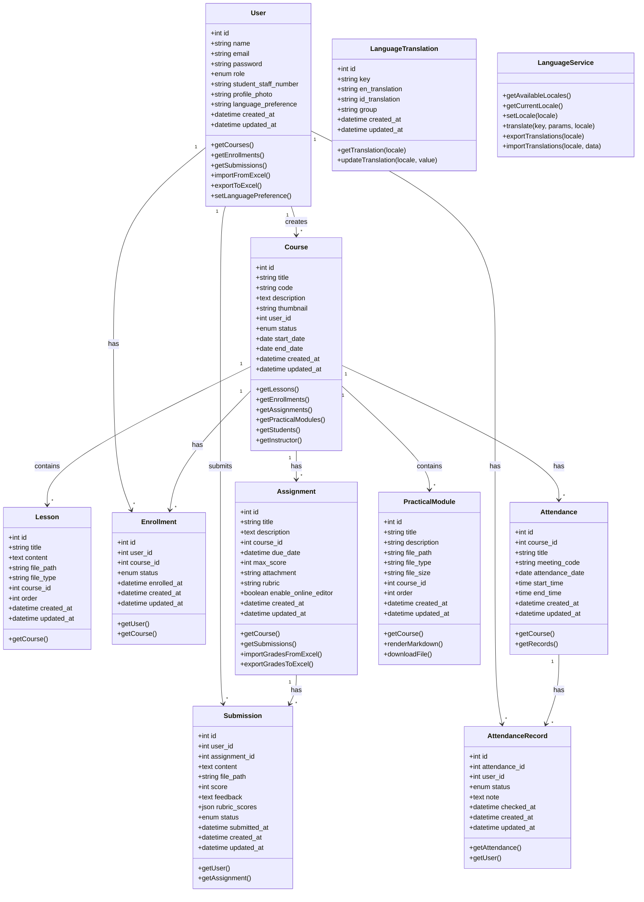
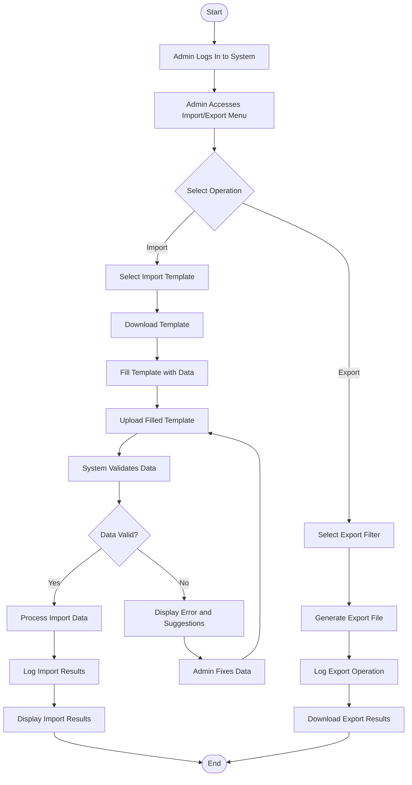

# Diagram Perancangan LMS

## 1. Entity Relationship Diagram (ERD)

```mermaid
erDiagram
    USER {
        int id PK
        string name
        string email
        string password
        enum role
        string student_staff_number
        string profile_photo
        string language_preference
        datetime created_at
        datetime updated_at
    }
    
    COURSE {
        int id PK
        string title
        string code
        text description
        string thumbnail
        int user_id FK
        enum status
        date start_date
        date end_date
        datetime created_at
        datetime updated_at
    }
    
    LESSON {
        int id PK
        string title
        text content
        string file_path
        string file_type
        int course_id FK
        int order
        datetime created_at
        datetime updated_at
    }
    
    ENROLLMENT {
        int id PK
        int user_id FK
        int course_id FK
        enum status
        datetime enrolled_at
        datetime created_at
        datetime updated_at
    }
    
    ASSIGNMENT {
        int id PK
        string title
        text description
        int course_id FK
        datetime due_date
        int max_score
        string attachment
        string rubric
        boolean enable_online_editor
        datetime created_at
        datetime updated_at
    }
    
    SUBMISSION {
        int id PK
        int user_id FK
        int assignment_id FK
        text content
        string file_path
        int score
        text feedback
        json rubric_scores
        enum status
        datetime submitted_at
        datetime created_at
        datetime updated_at
    }
    
    ATTENDANCE {
        int id PK
        int course_id FK
        string title
        string meeting_code
        date attendance_date
        time start_time
        time end_time
        datetime created_at
        datetime updated_at
    }
    
    ATTENDANCE_RECORD {
        int id PK
        int attendance_id FK
        int user_id FK
        enum status
        text note
        datetime checked_at
        datetime created_at
        datetime updated_at
    }
    
    ANNOUNCEMENT {
        int id PK
        string title
        text content
        int course_id FK
        int user_id FK
        boolean is_important
        datetime created_at
        datetime updated_at
    }
    
    NOTIFICATION {
        int id PK
        int user_id FK
        string title
        text content
        string link
        boolean is_read
        datetime created_at
        datetime updated_at
    }
    
    PRACTICAL_MODULE {
        int id PK
        string title
        string description
        string file_path
        string file_type
        string file_size
        int course_id FK
        int order
        datetime created_at
        datetime updated_at
    }
    
    IMPORT_EXPORT_TEMPLATE {
        int id PK
        string name
        string file_path
        enum type
        string description
        datetime created_at
        datetime updated_at
    }
    
    IMPORT_EXPORT_LOG {
        int id PK
        int user_id FK
        string file_path
        enum operation_type
        enum status
        text result_message
        int records_processed
        int records_success
        int records_failed
        datetime created_at
        datetime updated_at
    }
    
    LANGUAGE_TRANSLATION {
        int id PK
        string key
        string en_translation
        string id_translation
        string group
        datetime created_at
        datetime updated_at
    }
    
    PERMISSION {
        int id PK
        string name
        string guard_name
        datetime created_at
        datetime updated_at
    }
    
    ROLE {
        int id PK
        string name
        string guard_name
        datetime created_at
        datetime updated_at
    }
    
    ROLE_HAS_PERMISSION {
        int role_id FK
        int permission_id FK
    }
    
    USER_HAS_ROLE {
        int user_id FK
        int role_id FK
    }
    
    USER_HAS_PERMISSION {
        int user_id FK
        int permission_id FK
    }
    
    USER ||--o{ COURSE : "creates"
    USER ||--o{ ENROLLMENT : "enrolls"
    USER ||--o{ SUBMISSION : "submits"
    USER ||--o{ ATTENDANCE_RECORD : "has"
    USER ||--o{ ANNOUNCEMENT : "creates"
    USER ||--o{ NOTIFICATION : "receives"
    USER ||--o{ IMPORT_EXPORT_LOG : "performs"
    
    COURSE ||--o{ LESSON : "contains"
    COURSE ||--o{ ENROLLMENT : "has"
    COURSE ||--o{ ASSIGNMENT : "has"
    COURSE ||--o{ ATTENDANCE : "has"
    COURSE ||--o{ ANNOUNCEMENT : "has"
    COURSE ||--o{ PRACTICAL_MODULE : "has"
    
    ASSIGNMENT ||--o{ SUBMISSION : "has"
    ATTENDANCE ||--o{ ATTENDANCE_RECORD : "has"
    
    USER ||--o{ USER_HAS_ROLE : "has"
    ROLE ||--o{ USER_HAS_ROLE : "assigned to"
    
    USER ||--o{ USER_HAS_PERMISSION : "has"
    PERMISSION ||--o{ USER_HAS_PERMISSION : "assigned to"
    
    ROLE ||--o{ ROLE_HAS_PERMISSION : "has"
    PERMISSION ||--o{ ROLE_HAS_PERMISSION : "assigned to"
```



## 2. Use Case Diagram



## 3. Sequence Diagram

### 3.1. Assignment Grading



### 3.2. Language Switching



### 3.3. Import/Export Users



### 3.4. Markdown Practical Modules



## 4. Class Diagram



## 5. Activity Diagram

### 5.1. Assignment Grading Process

```mermaid
graph TD
    Start([Start]) --> StudentSubmit[Student Submits Assignment]
    StudentSubmit --> DisplayList[Instructor Views Assignment List]
    
    DisplayList --> OpenGradingForm[Open Grading Form]
    OpenGradingForm --> DisplaySplitView[Display Split View: Form and Assignment]
    
    DisplaySplitView --> SelectMethod{Select Grading Method}
    
    SelectMethod -->|Rubric| GradeRubric[Grade Per Rubric Category]
    SelectMethod -->|Direct| GradeDirect[Input Total Score]
    
    GradeRubric --> AutoCalculation[Automatic Total Score Calculation]
    GradeDirect --> InputFeedback[Input Written Feedback]
    AutoCalculation --> InputFeedback
    
    InputFeedback --> UploadFeedbackFile[Upload Feedback File (Optional)]
    UploadFeedbackFile --> ReviewGrade[Review Grade and Feedback]
    
    ReviewGrade --> Revision{Need Revision?}
    Revision -->|Yes| SelectMethod
    Revision -->|No| SaveGrade[Save Grade and Feedback]
    
    SaveGrade --> NotifyStudent[Send Notification to Student]
    NotifyStudent --> StudentView[Student Views Grade]
    
    StudentView --> End([End])

```

### 5.2. Language Switching Process

```mermaid
graph TD
    Start([Start]) --> UserLogin[User Logs In]
    UserLogin --> CheckPreference{Check Language Preference}
    
    CheckPreference -->|Preference Exists| LoadPreferredLanguage[Load Preferred Language]
    CheckPreference -->|No Preference| LoadDefaultLanguage[Load Default Language (ID)]
    
    LoadPreferredLanguage --> DisplayInterface[Display Interface]
    LoadDefaultLanguage --> DisplayInterface
    
    DisplayInterface --> UserClick[User Clicks Language Selector]
    UserClick --> ShowLanguageOptions[Display Language Options (ID/EN)]
    
    ShowLanguageOptions --> SelectLanguage[User Selects Language]
    SelectLanguage --> SavePreference[Save Language Preference]
    
    SavePreference --> LoadTranslations[Load Translations for Selected Language]
    LoadTranslations --> RefreshInterface[Refresh Interface]
    
    RefreshInterface --> UserContinue[User Continues Using System]
    UserContinue --> End([End])
```

### 5.3. Import/Export Process



### 5.4. Creating Markdown Module

```mermaid
graph TD
    Start([Start]) --> InstructorLogin[Instructor Login]
    InstructorLogin --> CourseMenu[Instructor Selects Course]
    CourseMenu --> ModuleMenu[Instructor Selects Practical Module Menu]
    
    ModuleMenu --> SelectAction{Select Action}
    SelectAction -->|Upload New Module| ModuleForm[Display Module Upload Form]
    SelectAction -->|Edit Metadata| SelectModule[Select Module to Edit]
    
    ModuleForm --> InputTitle[Input Title and Module Information]
    
    Note over InputTitle: Instructor has created file outside application
    
    InputTitle --> SelectFile[Select File to Upload]
    SelectFile -->|Markdown File| UploadMarkdown[Upload Markdown File]
    SelectFile -->|PDF File| UploadPDF[Upload PDF File]
    
    UploadMarkdown --> PreviewMarkdown[Preview Rendered Markdown]
    UploadPDF --> VerifyPDF[Verify PDF File]
    
    PreviewMarkdown --> ConfirmUpload[Confirm Upload]
    VerifyPDF --> ConfirmUpload
    
    ConfirmUpload --> PublishModule[Publish Module]
    
    PublishModule --> NotifyStudents[Send Notification to Students]
    
    SelectModule --> EditMetadata[Edit Module Information]
    EditMetadata --> ConfirmEdit[Confirm Changes]
    ConfirmEdit --> PublishModule
    
    NotifyStudents --> StudentAccess[Student Accesses Module]
    StudentAccess --> SelectViewFormat{Select Format}
    
    SelectViewFormat -->|Markdown| ViewMarkdown[View Rendered Markdown]
    SelectViewFormat -->|PDF| DownloadPDF[Download PDF]
    
    ViewMarkdown --> End([End])
    DownloadPDF --> End
```

## 6. Multi-language Implementation Notes

Multi-language support in this LMS system is implemented through:

1. **Database Structure**:
   - `language_preference` field in the User model
   - `language_translation` table to store translations

2. **Implementation Components**:
   - Middleware that sets application locale based on user preference
   - Translation files for static content
   - Database translations for dynamic content
   - Language selector in the user interface

3. **Translation Strategy**:
   - Translation keys follow hierarchical structure (e.g., `course.fields.title`)
   - Indonesian and English translations managed in the same system
   - Default language (Indonesian) used when translation not found

4. **Integration with Filament Admin Panel**:
   - Utilizing Filament's built-in localization features
   - Custom language selector component in admin interface
   - Translation management screen for administrators

This design diagram focuses on the technical structure of the application, while the actual language content will be implemented in the user interface.

## 7. MVP (Minimum Viable Product) Features for LMS

1. User Management

- Registration & Login: Basic authentication system for all users
- Role Management: Admin, Instructor, and Student with different access rights
- User Profile: Basic user information (name, email, student/staff number, profile photo)
- Password Reset: Ability to reset password via email

2. Course Management

- Course Creation: Instructors can create new courses
- Course Details: Basic information (title, code, description, thumbnail)
- Enrollment: Students can enroll in courses
- Course Dashboard: View of all courses followed/created

3. Learning Materials

- Material Upload: Instructors can upload learning materials (text, files)
- Material Organization: Ordering of materials by meeting
- Material Access: Students can view and download materials
- File Types: Support for common formats (PDF, DOCX, PPTX, etc.)

4. Assignments and Grading

- Assignment Creation: Instructors can create and configure assignments
- Assignment Submission: Students can submit assignments through the system
- Basic Grading: Instructors can provide grades and simple feedback
- Deadline Notifications: Reminders for submission deadlines

5. Attendance

- Attendance Recording: Instructors can record student attendance
- Meeting Codes: Unique code system for attendance verification
- Attendance Reports: Summary view of student attendance
- Attendance Status: Present, Absent, Excused, Sick

6. Basic Notifications

- In-App Notifications: Notifications for important activities
- Assignment Notifications: Alerts for new assignments and deadlines
- Grade Notifications: Alerts when grades are given
- Course Announcements: Notifications for new announcements

7. Simple Multi-language Support

- Language Options: Support for Indonesian and English languages
- Language Preferences: Users can select preferred language
- UI Translation: Interface elements in two languages
- Preference Storage: Language settings stored in user profile
- Dynamic Translation: Ability to dynamically translate UI content
- Language Files: Use of language files for static content
- Language Middleware: Implementation of middleware for application locale setting
- Default Language: Use of Indonesian as default language

8. Simple Admin Panel

- User Management: Admins can view, edit, and delete users
- Course Management: Admins can manage all courses
- Basic Statistics: Dashboard with key system metrics
- Global Announcements: Admins can create announcements for all users

9. Basic Import/Export

- Import Templates: Basic templates for user data import
- Data Export: Ability to export basic data (users, grades)
- Data Validation: Simple validation for imported data
- Import/Export Logs: Recording of import/export activities

10. Responsive Interface

- Mobile-Friendly Design: UI that works well on desktop and mobile devices
- Responsive Dashboard: Dashboard view that adapts to screen size
- Adaptive Navigation: Responsive navigation menu for various devices
- Responsive Components: All UI components work well across different screen sizes
